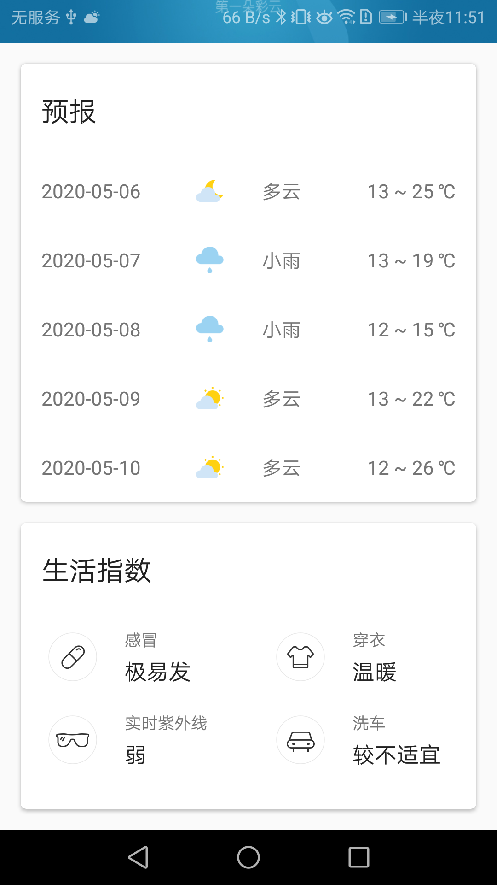

[](https://github.com/xfhy)
[](https://blog.csdn.net/xfhy_)

## 1. SunnyWeather
第一行代码,天气项目实战

## 2. 项目截图

<p>




</p>

## 3. 构建SunnyWeather

### 3.1 Retrofit构建器

首先是常规操作,利用retrofit构建interface动态代理对象
```kotlon
//构建serviceClass的动态代理对象
fun <T> create(serviceClass: Class<T>): T = retrofit.create(serviceClass)
```

然后是利用泛型实化,因为传入的泛型T,我们是能够在内联函数(加了reified关键字)中获取到T的实际类型的,所以可以简写成如下形式

```kotlin
/**
 * 泛型实化,,首先是内联函数,其次得加reified关键字,然后可以在函数内获取当前指定泛型的实际类型
 * 内联函数是替换到被调用的地方,所以不存在泛型擦除(泛型对于类型的约束只在编译期存在)问题
 */
inline fun <reified T> create(): T = create(T::class.java)
```

### 3.2 利用协程简化网络请求

首先是构建interface动态代理对象,

```kotlin
private val placeService = ServiceCreator.create(PlaceService::class.java)
```

因为平时我们使用Retrofit是下面这样的:
```kotlin
val appService = ServiceCreator.create<AppService>()
appService.getAppData().enqueue(object : Callback<List<App>> {
    override fun onResponse(call: Call<List<App>>, response: Response<List<App>>){
        //得到服务器返回的数据
    }
    
    override fun onFailure(call: Call<List<App>>,t: Throwable) {
        //在这里对异常情况进行处理
    }
})
```

这里其实我们可以用协程进行简化,我们扩展Call,给Call扩展一个await方法

```kotlin
/**
 * 扩展Retrofit的Call  让其拥有await方法
 * 简化网络请求,避免每次写回调
 */
private suspend fun <T> Call<T>.await(): T {
    //将异步网络请求放入suspendCoroutine,这里会将Lambda表达式的内容在普通线程中执行,当前协程会被挂起,然后调用continuation.resume()才会恢复当前协程
    return suspendCoroutine { continuation ->
        //因为是扩展函数,所以有Call的上下文环境,所以可以直接调用enqueue方法进行异步网络请求
        enqueue(object : Callback<T> {
            override fun onFailure(call: Call<T>, t: Throwable) {
                continuation.resumeWithException(t)
            }

            override fun onResponse(call: Call<T>, response: Response<T>) {
                val body = response.body()
                if (body != null) {
                    continuation.resume(body)
                } else {
                    continuation.resumeWithException(RuntimeException("response body is null"))
                }
            }
        })
    }
}
```
这里扩展了Call,搞了一个await的挂起函数,因为我们扩展的是Call<T>,这样所有返回值是Call<T>类型的都可以调用await方法了.这里用suspendCoroutine来挂起当前协程,
将异步网络请求放入suspendCoroutine,这里会将Lambda表达式的内容(就是传入的参数continuation)在普通线程中执行,当前协程会被挂起,然后调用continuation.resume()才会恢复当前协程.
在suspendCoroutine里面进行了网络网络请求,等网络请求完了调用resume恢复当前协程执行,且有返回值.这里的返回值包含了成功和失败的时候.

### 3.3 构建Repository

Repository用于请求网络数据或本地数据操作,这里暂时写一个请求网络的方法searchPlaces. 用liveData方法构建一个LiveData对象,并且里面是有协程的上下文环境的.  
 将传入的query关键字进行网络请求,得到结果,通过设置LiveData的值将数据回调出去,通知观察者.

```kotlin
object Repository {

    //这里liveData是一个函数,是lifecycle-livedata-ktx库提供的,它会自动构建一个LiveData对象并返回
    //在liveData函数的代码块中提供了挂起函数的上下文(LiveDataScope),可以在里面调用任意挂起函数
    //因为是网络请求  所以放子线程里面去
    fun searchPlaces(query: String) = liveData(Dispatchers.IO) {
        val result = try {
            val placeResponse = SunnyWeatherNetwork.searchPlaces(query)
            if (placeResponse.status == "ok") {
                val places = placeResponse.places
                //用Kotlin内置的Result包装一下结果
                Result.success(places)
            } else {
                Result.failure(RuntimeException("response status is ${placeResponse.status}"))
            }
        } catch (e: Exception) {
            Result.failure<List<Place>>(e)
        }

        //这里的emit方法类似于LiveData的setValue方法
        //将包装结果发射出去
        emit(result)
    }

}
```

### 3.4 构建ViewModel

有了Repository,就可以直接在ViewModel里面通过它获取数据了.下面是将关键字query传入给searchLiveData这个LiveData,searchLiveData一旦变化,
就会被Transformations.switchMap那里所感知,然后去请求网络数据,最后网络数据放到placeLiveData这个LiveData里面.

```kotlin
class PlaceViewModel {

    private val searchLiveData = MutableLiveData<String>()
    
    //Transformations.switchMap 观察searchLiveData这个LiveData对象
    val placeLiveData = Transformations.switchMap(searchLiveData) { query ->
        Repository.searchPlaces(query)
    }

    /**
     * 搜索
     */
    fun searchPlaces(query: String) {
        //将搜索关键词传入,更新LiveData->更新上面的Transformations.switchMap(searchLiveData) 然后进行网络请求,更新了placeLiveData这个LiveData
        searchLiveData.value = query
    }

}
```
